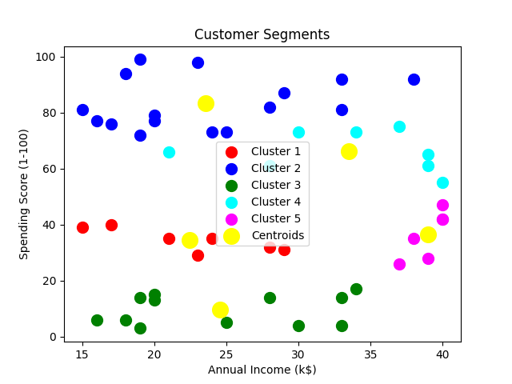

# 🧠 Task 2 - Customer Segmentation using K-Means Clustering

This project applies the *K-Means clustering algorithm* to segment customers based on their *annual income* and *spending score*, helping businesses better understand customer behavior.

---

## 📂 Dataset Used

- *File:* mall_customers.csv
- *Columns Used:* 
- Annual Income (k$)
 - Spending Score (1-100)

---

## ⚙ Technologies Used

- Python 🐍
- Pandas
- Matplotlib
- Scikit-learn (KMeans)

---

## Folder Structure

SCT_ML_2\
|__Task2\
   |__main.py
   |__mall_customers.csv
   |__README.md

---

## 📈 Elbow Method – Optimal Clusters

The elbow method is used to find the ideal number of clusters (K). The graph below shows the "elbow point" around K=5.

---

## 📊 Output Visualization

Each color in the scatter plot represents a customer cluster based on spending and income. Yellow dots indicate the centroids.

---

## 🧪 How to Run

1. Clone this repository or download the Task2 folder
2. Install required libraries:
   **bash**
   pip install pandas matplotlib scikit-learn
3. python main.py

---

## Learnings

implemented unsupervised learning using K-Means
Understood how customer segmentation helps in targeting specific groups
Learned to visualize clusters and interpret them

---

## Github link

(https://github.com/Ananya953/SCT_ML_2.git)

---

**Ananya T C**
4th year(Akshaya Institution of Technology)
ananyagowda2710@gmail.com
Intern at SkillCraft Technology
@SCT #SCT
